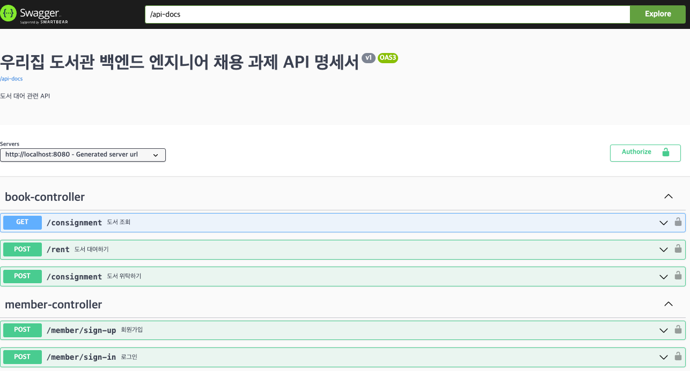

# 우리집도서관(이하 우도) 백앤드 엔지니어 과제

---
## 서비스 이해 및 요청사항
**우리집도서관**은 사용자가 자신의 집에 있는 책을 위탁하면, 다른 사룔자는 위탁 도서를 대여할 수 있는 서비스를 제공하는 도서공유 서비스입니다.

### 상세내용
1. 서비스 기획의 대한 이해도
2. 기능 요구사항에 대한 효율적이고 적시적인 구현
3. 버그를 최소화 하는 높은 코드 품질
4. 유연한 변경 사항 대응을 위한 재사용성 및 확장 가능한 애플리케이션 구조 설계
5. 협업을 위한 코드 및 문서 가독성

### 필요기능
1. 회원가입
2. 로그인
3. 도서위탁
4. 위탁 도서 조회(No Offset Pagination)
5. 도서대여
6. 도서반납(스케줄러)

---
## 구현 방향
1. 도서 도메인의 대한 이해도를 높이기 위해 도서 서비스에서 사용되는 전체적인 용어를 찾아봤습니다.
2. 특히 헷깔리는 부분은 대여라는 단어였습니다. 보통 도서 대출 이라고 표현 했던걸로 기억하고 있었는데 실제 대여라는 뜻은 도서관 외의 지역에서 책을 빌릴 때 사용하는 단어라고 학습을 했습니다. 또한 ISBN 이라는 단어를 처음 접했지만 결국 고유하게 식별하기 위한 식별자라고 이해했습니다.
3. 위 개념을 토대로 회원가입 및 로그인 그리고 위탁하기 대여하기 순으로 작업을 진행했습니다.
4. No Offset Pagination 기능이 요구사항에 효율적이라고 생각해서 위탁 도서 조회시 해당 기능으로 구현했습니다.
5. 또한 도서 대여하는 과정에서 동시성 이슈가 발생할 수 있기 때문에 비관적 잠근을 활용해서 해당 문제를 해결 했습니다.
6. 마지막으로 10초 마다 실행되는 스케줄러를 통해 도서 반납 기능을 구현했습니다. 

## 개발환경
- `Java 17`
- `Spring Boot 3.x`
- `JPA`
- `H2`
- `Gradle`

## 프로그램 실행 방법
1. 특별한 환경 설정을 따로 진행하지 않았습니다. 또한 h2 inmemory 환경으로 데이터베이스를 설정했기 때문에 애플리케이션을 바로 실행하면 됩니다.
2. http://localhost:8080/swagger-ui/index.html 접속 후 검색 창의 /api-docs 를 검색하면 API 스팩 문서가 보여집니다.
